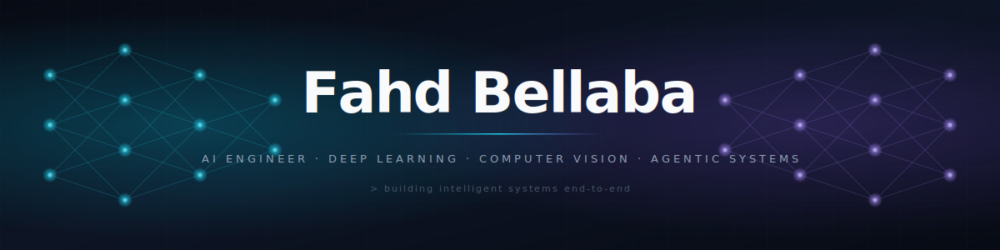

<!--
  ╔══════════════════════════════════════════════════════════════════╗
  ║  GitHub Profile README — Fahd Bellaba                            ║
  ║  Repo path: <username>/<username>/README.md                      ║
  ║                                                                  ║
  ║  ▶ Replace `FahdBellaba` everywhere with your real GitHub        ║
  ║    username. It's used in the banner, all stats widgets, the     ║
  ║    snake animation, and the trophy card.                         ║
  ╚══════════════════════════════════════════════════════════════════╝
-->

<!-- ══════════════ HERO BANNER ══════════════
     Save banner.svg to assets/banner.svg in your profile repo.
     The path below assumes that location. -->
<p align="center">
  
</p>

<p align="center">
  <a href="https://git.io/typing-svg">
    
  </a>
</p>

<p align="center">
  
  
  
  
</p>

---

## About

AI Engineer with 3+ years of experience designing and deploying deep learning systems across computer vision, multimodal AI, and large-scale inference workflows.

My work focuses on building reliable end-to-end AI pipelines — from dataset engineering and model training to optimization, deployment, and production orchestration.


---

### Current Focus

* Computer Vision Systems
* Vision-Language Models
* Agentic AI Workflows
* Segmentation & Detection Pipelines
* Synthetic Data Generation

---
## Core Expertise

<table>
<tr>
<td width="25%" valign="top">

### Computer Vision

* Object Detection
* Semantic Segmentation
* Aerial Imagery Analysis
* Video Analytics
* OCR & Image Understanding
* Vision-Language Systems

</td>
<td width="25%" valign="top">

### AI Systems Engineering

* Distributed Training
* Inference Optimization
* Containerized Deployment
* MLOps & Reproducibility
* Evaluation Pipelines
* Production ML Workflows

</td>
<td width="25%" valign="top">

### LLM & Agentic Systems

* Hybrid RAG
* Multi-Agent Systems
* Tool-Calling Agents
* Structured Generation
* Retrieval Optimization
* LangGraph Workflows

</td>
<td width="25%" valign="top">

### Generative AI

* Stable Diffusion
* LoRA Fine-Tuning
* ControlNet
* Synthetic Data Pipelines
* Image-to-Image Workflows

</td>
</tr>
</table>

---


## Tech Stack

### Core


### Additional Tools

```text
TensorFlow • JAX • Triton • Detectron2 • Diffusers • CVAT • FAISS • Linux • SQL
```

---


## Featured Projects

### Aerial Imagery → Vector Infrastructure Pipeline

End-to-end deep learning pipeline converting high-resolution aerial imagery into structured vector outputs.

**Highlights**

* Automated preprocessing and tiling workflows
* DeepLabv3+ segmentation pipeline
* Polygonization & vector generation
* Optimized large-scale batch inference
* Containerized deployment workflow

`PyTorch` · `DeepLabv3+` · `Docker` · `Segmentation`

---

### Multi-Modal Object Detection System

Detection pipeline designed for sparse imagery, dense imagery, ortho-mosaics, and full-motion video.

**Highlights**

* Multi-class detection workflows
* Active-learning dataset refinement
* CVAT-assisted annotation pipelines
* Real-world deployment optimization

`YOLOv5/v8` · `CVAT` · `Active Learning` · `Video Analytics`

---

### Multi-Agent Research Assistant

LangGraph-based multi-agent system for planning, retrieval, reasoning, and verification workflows.

**Features**

* Planner-agent task decomposition
* Parallel specialist agents
* Hybrid RAG architecture
* Tool-calling workflows
* Critic-agent verification loops

`LangGraph` · `RAG` · `Qdrant` · `Function Calling`

---

## 💡 Currently Exploring

<p>
  
  
  
  
</p>

---

## Connect

<p align="center">
  <a href="https://www.linkedin.com/in/fahd-bellaba-44ba24234">
    
  </a>
  <a href="mailto:Fahdbellaba@gmail.com">
    
  </a>
</p>

<p align="center">
  <i>Building reliable AI systems from research to production.</i>
</p>

---


<!--
  ════════════════════════════════════════════════════════════════════
  SETUP CHECKLIST
  ════════════════════════════════════════════════════════════════════
  [ ] Save the provided `banner.svg` file into your profile repo at
      the path: `assets/banner.svg`
      (Or place it at the repo root and change the  at
      the top of this README to `./banner.svg`.)

  [ ] Find-and-replace `FahdBellaba` with your real GitHub username.
      It appears in: profile-views badge, all 4 stats widgets,
      trophy card, activity graph, and the snake animation path.

  [ ] Repo MUST be public AND named exactly the same as your username.
      Place this file as README.md at the repo root.

  [ ] (Optional but recommended) Enable the snake animation:
      Create .github/workflows/snake.yml in your profile repo with the
      generator from https://github.com/Platane/snk
      It will populate the `output` branch the snake image points to.

  [ ] Pin 4–6 of your strongest repos on your GitHub profile so they
      appear next to this README.

  [ ] Replace "(Building)" / "(Exploring)" tags with real repo links
      as soon as you ship those projects.
  ════════════════════════════════════════════════════════════════════
-->
